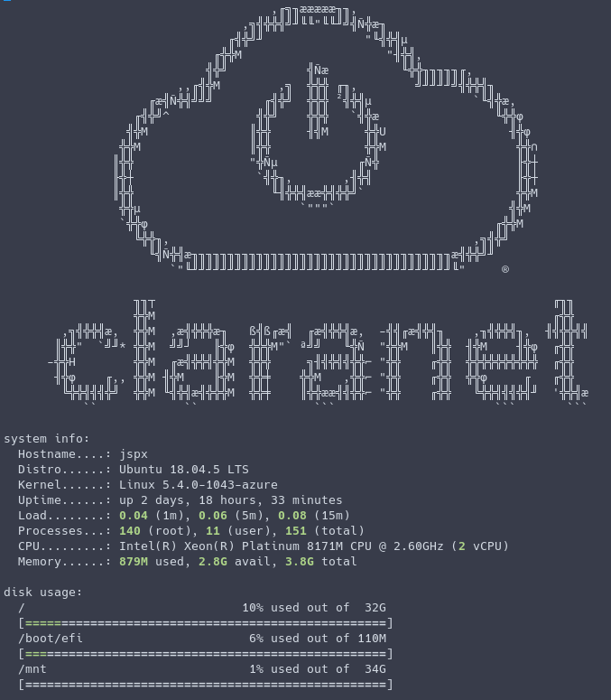

# Motd

Here is motd for Claranet.

## Preview



## Requirements

Your system must use an UTF-8 locale

Ensure that your `$LANG` variable equals `xx_XX.UTF-8`

## Installation

### Banner

Copy [motd](motd) file to `/etc/banner`:

```bash
curl -s https://raw.githubusercontent.com/claranet/motd/master/banner -o /etc/banner
```

_Be sure to enable `Banner /etc/banner` in `/etc/ssh/sshd_config`_

### MOTD

**Using Ansible**

You can use this Ansible role to install this MOTD : [https://github.com/claranet/ansible-role-motd](https://github.com/claranet/ansible-role-motd)

It do a low level installation so it is compatible with _all_ Linux distros

**Manual**

> It is compatible with [update-motd](https://launchpad.net/update-motd) used by Ubuntu.

```bash
mkdir /etc/update-motd.d
curl -s https://raw.githubusercontent.com/claranet/motd/master/scripts/00-basic -o /etc/update-motd.d/00-basic
chmod +x /etc/update-motd.d/00-basic
```

For not compatible distributions you will have to add the following line to `/etc/pam.d/sshd` and `/etc/pam.d/login`:

```
session    optional   pam_exec.so          stdout /etc/update-motd.d/00-basic
```

You could also want to disable the "last login" information by configuring `PrintLastLog` to `no` in `/etc/ssh/sshd_config`.
